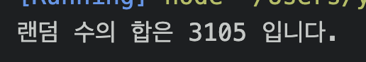

## 문제 1

```js
var ssn = "9203211";
let date = new Date();
let now_year = date.getFullYear();

var yy = parseInt(ssn.substring(0, 2));
let gen = parseInt(ssn.substring(6, 7));
var yy = gen > 2 ? yy + 2000 : yy + 1900;
let age = now_year - yy + 1;
let sex = gen % 2 ? "남자" : "여자";

console.log("당신은 %d세 %s입니다.", age, sex);
```


## 문제 2

```js
function random(n1, n2) {
  return parseInt(Math.random() * (n2 - n1 + 1)) + n1;
}
var number = random(100, 200);
//console.log(number);

let randomSum = 0;
for (let i = 0; i <= number; i++) {
  if (i % 3 == 0) {
    randomSum += i;
  }
}
//console.log(number);
console.log("랜덤 수의 합은 %d 입니다.", randomSum);
```



## 문제 3

```js
function hashadNum(x) {
  x += "";
  var beforeNum = x.substring(0, 1);
  var afterNum = x.substring(1);
  //console.log(beforeNum);
  //console.log(afterNum);

  var testSum = parseInt(beforeNum) + parseInt(afterNum);
  //console.log(testSum);

  if (x % testSum == 0) {
    return true;
  } else {
    return false;
  }
}

console.log(hashadNum(10));
console.log(hashadNum(12));
console.log(hashadNum(11));
console.log(hashadNum(13));
```


## 문제 4

```js
class Solution {
  constructor(k, n, m) {
    this._k = k;
    this._n = n;
    this._m = m;
  }
  get k() {
    return this._k;
  }
  set k(param) {
    this._k = param;
  }
  getMoney() {
    //만약에 30 * 4 가 100보다 크면
    if (this.k * this._n > this._m) {
      return console.log(
        "동수가 부모님께 받아야하는 돈은 %d원입니다.",
        this.k * this._n - this._m
      );
    }
    //아니면
    else {
      return console.log("동수가 부모님께 받아야하는 돈은 0원입니다.");
    }
  }
}

const 용돈1 = new Solution(30, 4, 100);
용돈1.getMoney();

const 용돈2 = new Solution(250, 2, 140);
용돈2.getMoney();

const 용돈3 = new Solution(20, 6, 120);
용돈3.getMoney();

const 용돈4 = new Solution(20, 10, 320);
용돈4.getMoney();
```


## 문제 5

```js
class Student {
  constructor(grade) {
    //  let grade = new Array();
    this._grade = grade;
  }
  // get grade() {
  //   return this._grade;
  // }
  // set grade(value) {
  //   this._grade = value;
  // }

  //평균
  getSumAvg() {
    var sum = 0,
      sumAvg = 0;

    for (let i in this._grade) {
      sum += this._grade[i];
    }
    sumAvg = sum / this._grade.length;
    return console.log("평균 : " + sumAvg);
  }
  //최하점과 최고점
  getMinMax() {
    let maxGrade = this._grade[0];
    let minGrade = this._grade[1];

    for (let i in this._grade) {
      if (maxGrade < this._grade[i]) {
        maxGrade = this._grade[i];
      } else if (minGrade > this._grade[i]) {
        minGrade = this._grade[i];
      }
    }
    return console.log("최하점 : " + minGrade + "최고점 : " + maxGrade);
  }
  //분산
  getVar() {
    var sum = 0,
      sumAvg = 0;

    for (let i in this._grade) {
      sum += this._grade[i];
    }
    sumAvg = sum / this._grade.length;
    //return console.log(sumAvg);
    //console.log(this.getSumAvg());
    var arrSum = 0;
    var 분산 = 0;
    var 나누기 = this._grade.length - 1;

    //자료수에서 평균값 빼기
    for (let i in this._grade) {
      this._grade[i] = this._grade[i] - sumAvg;

      this._grade[i] = this._grade[i] * this._grade[i];
      arrSum += this._grade[i];
      분산 = arrSum / 나누기;
    }
    return console.log("분산:", 분산);
  }
  //표준편차
  getStd() {
    var sum1 = 0,
      sumAvg2 = 0;

    for (let i in this._grade) {
      sum1 += this._grade[i];
    }
    sumAvg2 = sum1 / this._grade.length;
    //return console.log(sumAvg);
    //console.log(this.getSumAvg());
    var arrSum2 = 0;
    var 분산 = 0;
    var 나누기 = this._grade.length - 2;
    var getStd = 0;
    //자료수에서 평균값 빼기
    for (let i in this._grade) {
      this._grade[i] = this._grade[i] - sumAvg2;
      this._grade[i] = this._grade[i] * this._grade[i];
      arrSum2 += this._grade[i];
      분산 = arrSum2 / 나누기 / 10;
      getStd = Math.sqrt(분산);
    }

    //console.log(분산);
    return console.log("표준편차 : ", getStd);
  }
}

var students = new Student([82, 76, 91, 98, 64]);

students.getSumAvg();
students.getMinMax();
students.getVar();
students.getStd();
```


